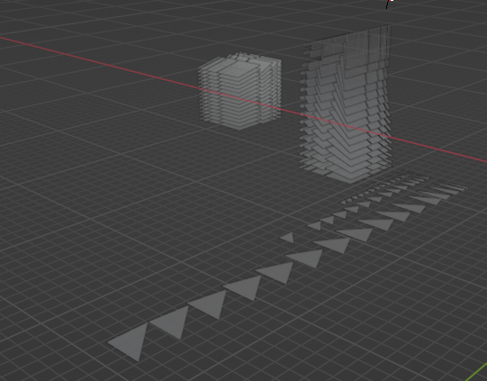
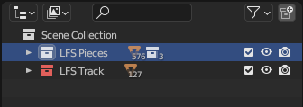
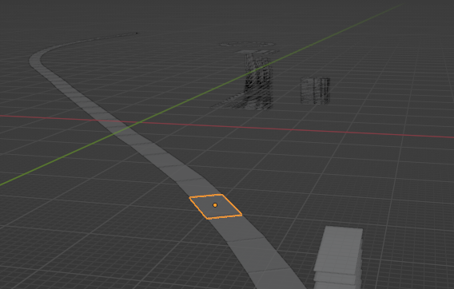
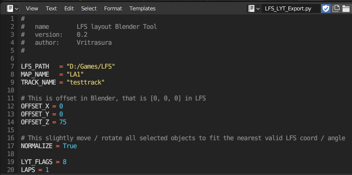
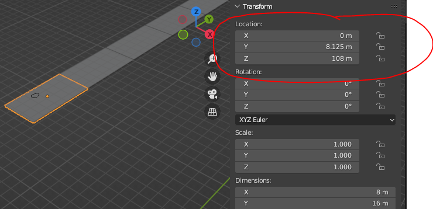
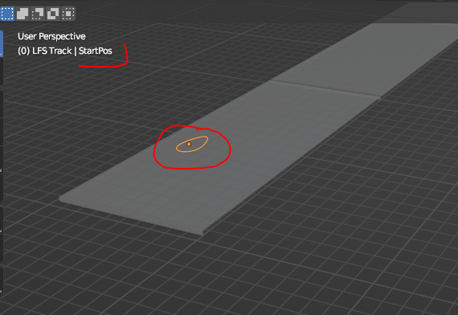
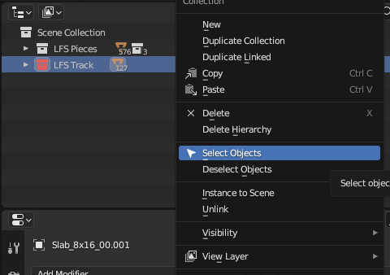
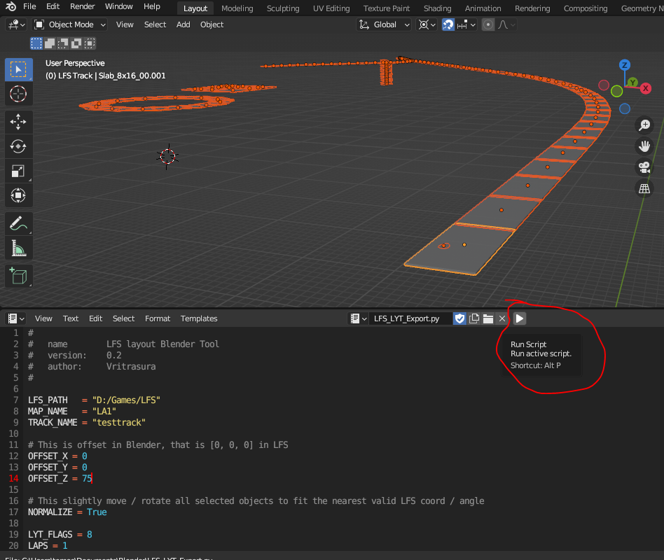
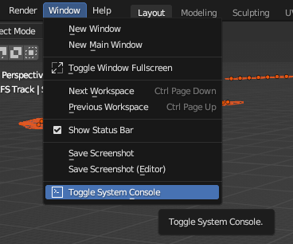

# Layout Editor Blender Tool

by Vritrasura

## Working with blocks

I have premodelled various blocks that can be used to create layout. In LFS you can change their parameters on the fly, but unfortunately I haven't found way how to do it, therefore I premodelled blocks in their all various configurations.

I have put those blocks into separate collection (LFS Pieces) so they do not mix.

You can pick some blocks you intend to use and simply copy and paste them (**Shift+D**).

Once copied you can put them into "LFS Track" collection (use **M** key), it will help you during export.

You can rotate pieces along Z axis (**R** + **Z**). To move them around, use **G** key.

Do not rotate them along X or Y axis, instead use premodelled block that already has proper pitch.

## Export settings

So you make your layout and now you want to export it... Then you need to check few things.

You want to set your `LFS_PATH` and `TRACK_NAME` and you must properly set `OFFSET_X`, `OFFSET_Y`, `OFFSET_Z`.

> **Note:** As of v21.0, `LFS_PATH`, `MAP_NAME`, and `TRACK_NAME` are configured in `config.ini` instead of being hardcoded in the script. See the [README](../README.md) for setup instructions.

To set the offset you can select some of your objects and press **N** and in the Transform window you can see the coordinates of the object.

- The range for X and Y is **+/- 2048**
- The range for Z is **0 ~ 64**

Set your `OFFSET` somewhere around this coordinate within the range.

## Normalize and StartPos

The `NORMALIZE` option (when `True`) will automatically reposition your blocks before export to match LFS coordinate system, so you should get exactly what you see in Blender in LFS as well.

There is special object called "StartPos" - this is where you get spawned.

## Selecting and exporting

When you edited all options, and set your starting position, now you need to select all objects that you want to export into layout.

If you keep your Blend file nicely organized, you can just do that by right clicking the LFS Track collection and selecting all pieces by one click.

Once selected all objects of interest, just hit the play button at the export script.

It might be good idea to turn on console window. The export script puts some output information there.

